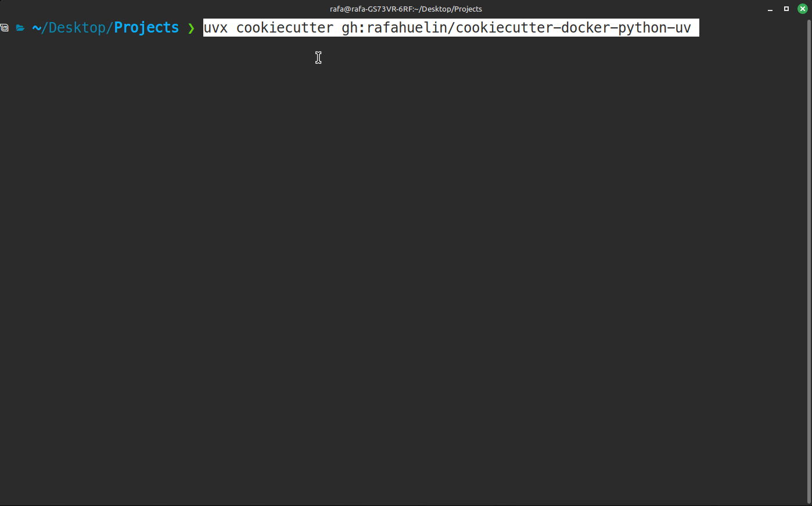
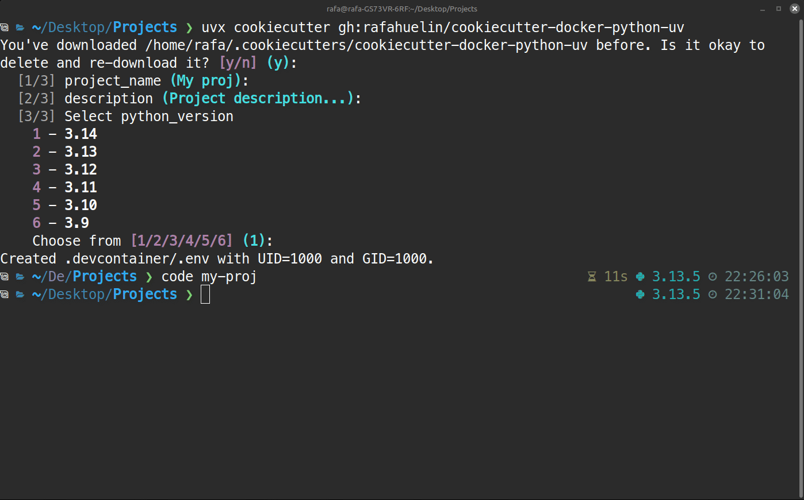
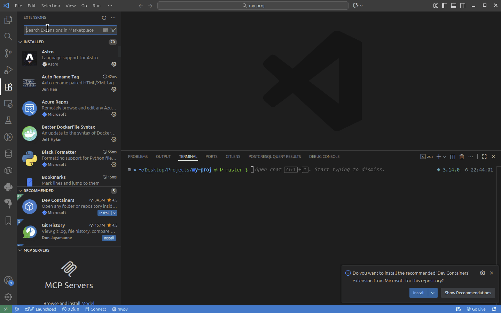
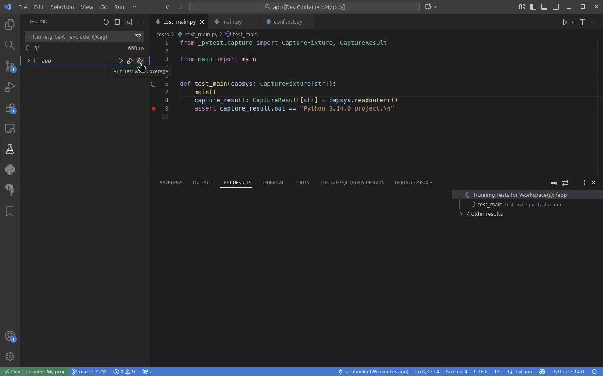
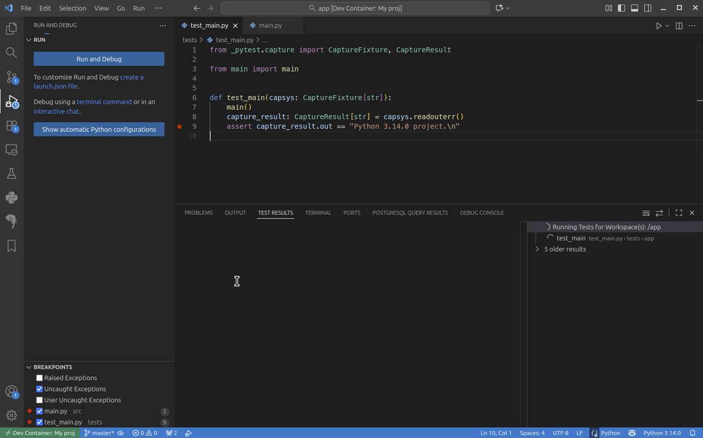
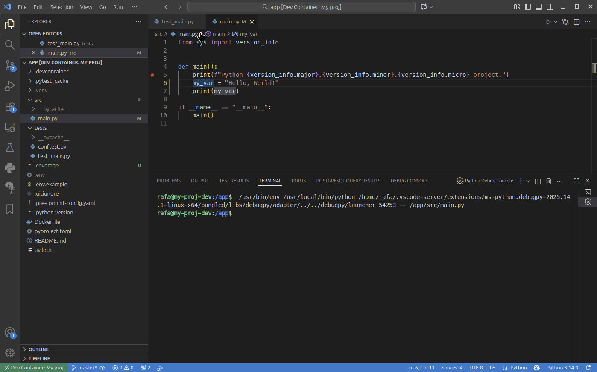

[](https://github.com/rafahuelin/cookiecutter-docker-python-uv/releases)
[](LICENSE)
[](https://github.com/cookiecutter/cookiecutter)

# 🍪 Cookiecutter Python Template

> A clean Cookiecutter template for building production-ready Dockerized Python apps with:
> - Docker
> - uv
> - Devcontainers
> - Ruff
> - pre-commit hooks.
>


## Generate project
[Install uv](https://docs.astral.sh/uv/getting-started/installation/) if you still don't have it and execute:
```shell
uvx cookiecutter gh:rafahuelin/cookiecutter-docker-python-uv
```

## Output Preview
```
📁 your-project/
├── .devcontainer/
│   ├── devcontainer.json
│   └── docker-compose.dev.yml
├── src/
│   └── main.py
├── tests/
│   ├── conftest.py
│   └── test_main.py
├── .env.example
├── .gitignore
├── .pre-commit-config.yaml
├── .python-version
├── Dockerfile
├── pyproject.toml
├── README.md
└── uv.lock
```

## Quick start

1. Generate Project
  
2. Open Project
  
3. Install Devcontainers extension
  
4. Run Tests with coverage
  
1. Debug Tests
  
1. Linter
  

## Features
- Dockerized Python Develpment setup with global uv setup (without virtual environment)
- Uses only actively supported CPython versions
  - Offered at project creation and pinned in the base image and .python-version.
- Single Dockerfile for dev and production
  - Develop locally with the same Dockerfile that builds your production image.
- VS Code Dev Container setup
  - Docker Compose-based dev environment.
  - Workspace is bind-mounted so Git status and changes behave exactly as on the host.
  - User UID and GID makes possible to edit files from inside or outside the devcontainer.
  - Linter with Error Lens and Ruff.
- Fast dependency management with uv
  - pyproject.toml-based workflow with uv for speedy, reproducible installs.
- Testing scaffold
  - pytest pre-configured with example tests.
  - coverage library pre-installed.
- Pre-commit hooks ready
  - Linting/formatting hooks configured via .pre-commit-config.yaml.
- Environment management
  - .env.example provided; .env consumed by the dev setup.
